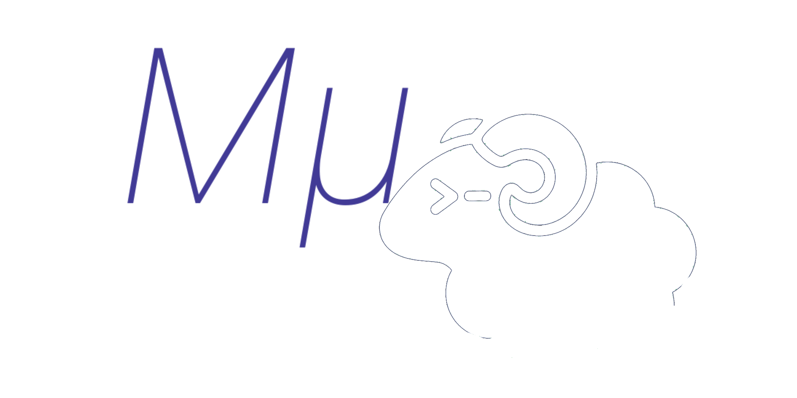

<div align="center">

  

</div>

[Herdr](https://herdr.dev) config. After the prefix, letters match [MμVim](https://github.com/AndresMpa/mu-vim) where a Herdr analog exists.

## Install

```
git clone https://github.com/AndresMpa/mu-herdr.git ~/.config/herdr
cd ~/.config/herdr
./install.sh
herdr
```

Installs the `herdr` binary if missing (Homebrew or herdr.dev), copies this tree to `~/.config/herdr` (skips sockets, logs, `themes/active`), sets the prefix, links `muherdr.notify`, and prepares OS notifiers. Already cloned there: chmod, prefix, notifiers only.

## Uninstall

```
cd ~/.config/herdr
./delete.sh
```

Removes this config, state, cache, `old-herdr`, the notify plugin, and the Linux desktop icon. Leaves the `herdr` binary and any config that is not MμHerdr.

## Prefix

**Ctrl-Alt-Space** (Linux) / **Control-Option-Space** (Mac). Token: `ctrl+alt+space`. Option is Alt.

Hold the modifiers and Space, **release**, then one letter. Prefix then `?` lists binds. Ctrl-B is not the prefix.

Herdr prefix mode takes **one** key. Sequences of two or three letters (`vv`, `gst`, `th`) open a helper that reads the rest.

Ctrl-Space, Shift-Space, Option-Space, and Command-Space are not portable (OS, Space, NBSP, Spotlight). Ctrl-Alt is the family Herdr documents as still reaching the app.

## Tabs and panes

| MμVim | After prefix | Action |
| --- | --- | --- |
| `Space q` | `q` | Detach (panes keep running). Also `d`. |
| — | `x` | Close focused pane |
| `Space h` | `h` | Close tab |
| `Space H` | `H` | Close other tabs |
| `Space j` / `k` | `j` / `k` | Previous / next tab |
| `Space l` | `l` | List tabs |
| `Space n` | `n` | Sidebar |
| `Ctrl-h/j/k/l` | `Ctrl-h/j/k/l` | Focus pane (no prefix) |
| — | `1`–`9` | Jump to tab |
| — | `c` | New tab |
| — | `r` | Resize mode |
| — | `o` | Jump to last notification pane |

Bare Ctrl-Q is XON in most terminals; Herdr never sees it.

## Splits

Prefix `v`, then:

| MμVim | Then | Action |
| --- | --- | --- |
| `Space vv` | `v` | Zoom this pane |
| `Space vj` | `j` | Split down |
| `Space vk` | `k` | Split right |

Prefix `t` then `t` (or wait) splits right (Ctrl-t analog). Prefix `t` then `h` is themes.

Popup chrome title: **Panes**.

## Git

Prefix `g`, then the same letters as MμVim. Popup title: **Git**. Esc cancels.

| Then | Action |
| --- | --- |
| `st` | Lazygit, or `git status` |
| `pl` / `ps` | `git pull` / `git push` |
| `ll` / `pp` | pull / push current branch |
| `px` | `git push -u` current branch |
| `aa` / `ap` | `git add --all` / `git add -p` |
| `bl` / `sh` | `git blame` / `git show` |
| `ii` | `git init` |
| `rv` | `git remote -v` |
| `c` | `git commit` (wait 1s; `co` / `cb` continue) |
| `sw` | `git switch …` |
| `gg` | `git …` |

## Themes

Prefix `t` then `h`. Popup title: **Themes**. Header still says MμHerdr.

`j`/`k` preview, Enter save, Esc restore, `❯` current row. Palettes match MμVim Current; default **deep-ocean**.

```
~/.config/herdr/bin/theme list
~/.config/herdr/bin/theme apply gruvbox
herdr server reload-config
```

`deep-ocean` `gruvbox` `mini` `oceanic` `palenight` `darker` `nord` `dracula` `tokyonight` `catppuccin` `onedark`

## SSH

Prefix `e`. Popup title: **SSH**. OpenSSH only (not `herdr machine`).

| Row | Enter |
| --- | --- |
| key (`~/.ssh/*.pub`) | `ssh-add` (Keychain on Mac); marks it for the next host |
| host (`Host` in `~/.ssh/config`, no `*`/`?`) | `ssh` that alias; marked key or `IdentityFile` |

`j`/`k`, Esc, `❯`. Passphrases stay in the popup. Private keys are not printed.

## Containers

Prefix `p`. Popup title: **Containers**. Docker, Podman, or nerdctl (`ps -a` only, no images).

`j`/`k` move, Enter adds the container as a pane in the current workspace (`docker:name` / `podman:name`), Esc cancels. Stopped containers are started, then `exec -it` (bash or sh). Duplicate engine/IDs are skipped.

## Navigate

Prefix `w` is **Herdr Navigate** (sidebar overlay), not a command popup.

| Key | In Navigate |
| --- | --- |
| `j` / `k` or ↓ / ↑ | Select workspace |
| `h` / `l` | Move pane |
| Esc | Leave Navigate |

`1`–`9` are Herdr’s overlay jumps. Splits, themes, SSH, and containers stay on prefix.

## Notifications

On agent **blocked** or **done** (not `working` / `idle`): one desktop banner with the ram (plugin), plus an in-app Herdr toast. `ui.toast.delivery` is `herdr` so Herdr does not post a second OS banner without the ram. Slack and Telegram off until configured.

| | |
| --- | --- |
| Title | `MμHerdr` |
| Blocked | `Workspace {name} ({model}) Need your attention` |
| Done | `Workspace {name} ({model}) finished` |
| Icon | Herdr ram, left side (`plugin/herdr.png`) |
| Jump | prefix `o` |

Marketplace (after the `herdr-plugin` GitHub topic is on this repo):

```
herdr plugin install AndresMpa/mu-herdr/plugin
```

`./install.sh` links `muherdr.notify` locally. If `herdr plugin list` is empty:

```
herdr plugin link ~/.config/herdr/plugin --enabled
```

Do not test with `herdr notification show` (no ram icon). Test:

```
HERDR_PLUGIN_EVENT_JSON='{"data":{"agent_status":"blocked","display_agent":"grok","workspace_id":"w1"}}' \
  bash ~/.config/herdr/plugin/notify.sh
```

**Mac:** install.sh installs `terminal-notifier` and brands `plugin/MuHerdr.app`. System Settings → Notifications → **MμHerdr** → Allow. Broken icon: `rm -rf ~/.config/herdr/plugin/MuHerdr.app` then `./install.sh`.

**Linux:** `notify-send` plus `~/.local/share/icons/hicolor/512x512/apps/muherdr.png`. If silent: `libnotify-bin` (apt) or `libnotify` (dnf/pacman). `./delete.sh` removes the desktop files.

**Slack / Telegram:** gitignored `notify.toml` next to `config.toml` (copy `notify.example`). `slack = true` + webhook and/or `telegram = true` + bot token and chat id. Env: `SLACK_WEBHOOK_URL`, `TELEGRAM_BOT_TOKEN`, `TELEGRAM_CHAT_ID`. Lines prefixed `MμHerdr:`.

## Debug

Inside a Herdr pane:

```
cd ~/.config/herdr
./debug.sh
herdr config check
herdr server reload-config
```

Prefix, release, `?`. Overlay means the prefix reached Herdr. Failed `v` / `g`: `chord.log`. Extra Herdr logs: `HERDR_LOG=herdr=debug herdr`.
